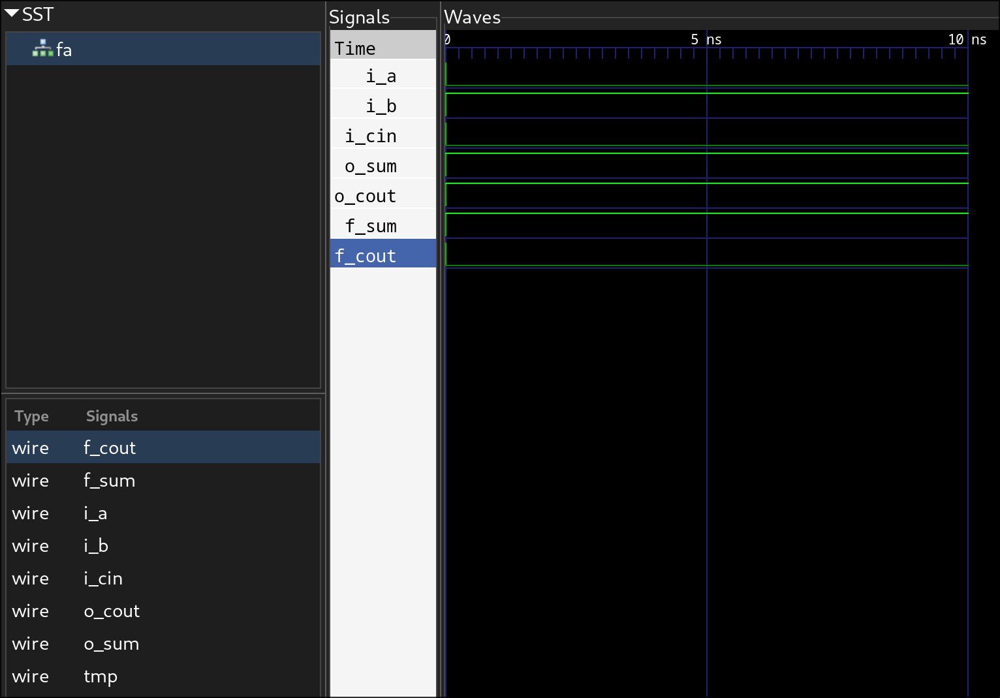

+++
title = "An introduction to formal verification: part 1"
date = "2025-03-05T22:18:52-06:00"
author = ""
authorTwitter = "" #do not include @
cover = ""
coverCaption = ""
tags = ["", ""]
keywords = ["", ""]
description = ""
showFullContent = false
readingTime = false
hideComments = false
color = "" #color from the theme settings
+++

Hi! This post is the first in a series introducing formal verification of hardware circuits in Verilog (and similar hardware description languages). While there are a couple of good resources for formal, especially [zipcpu.com](https://zipcpu.com), the literature is surprisingly sparse, especially including end to end examples.

In this series, I want to develop an intuition for formal verification from first principles, working up all the way to formally verifying a reasonably complex IP (perhaps a simple processor core) with examples. Lets get started!

> Note: this first article is mostly about motivation and how formal works. If you just want to see examples, stick around for the rest of the series.

# Motivation

Formal verification is a workflow and set of tools for testing that your hardware designs, typically written in an HDL, work "correctly". Formal methods have been applied to other domains too, including software verification, but that's out of scope for now. So how does it differ from traditional design verification, and why is it useful?

Traditional verification involves instantiating your device under test (DUT), connecting its ports to a set of registers, and poking at the inputs and observing outputs. We usually want to automatically test that designs work correctly and don't regress, so outputs are automatically compared against some expected values.

This is fine, but the main limitation is that it is prohibitively expensive to exhaustively test even the simplest designs. Exhaustively testing a 32 bit adder returns the correct value for every set of inputs takes (2 ^ 32) * (2 ^ 32) checks, which while possible, is unreasonably expensive. So usually engineers resort to a combination of explicitly testing suspected "edge cases" and some sort of random simulation, where random stimulus vectors are applied to the inputs and the outputs are verified against a golden model, with the hope that with enough samples the input space is sufficiently sampled.

A lot of effort rests on the engineer to come up with all the edge cases that matter, which is very time consuming. Miss one and your DUT may fail, which can be [extremely expensive](https://gitlab.freedesktop.org/mesa/mesa/-/issues/9185).

# Formal Verification

So can we have our cake and eat it too? Actually, it turns out that in many cases, we can. To see how, lets take a contrived example of a full adder cell. This takes 3 inputs, `a`, `b`, `carry_in` and produces a `sum` (exclusive or of the three bits) and `carry_out` (set if at least two of the input bits are set). In verilog:

```verilog
module fa (
    input  wire i_a,
    input  wire i_b,
    input  wire i_cin,
    output wire o_sum,
    output wire o_cout
);
    assign o_sum = i_a ^ i_b ^ i_cin;
    assign o_cout = (i_a & i_b) | (i_a & i_cin) | (i_b & i_cin);
endmodule
```
In boolean algebra, `sum = a ⊕ b ⊕ cin` and `cout = a ⋅ b + a ⋅ cin + b ⋅ cin`. Is there a way we can test that out circuit implements this expression for *all* inputs but *without* testing all inputs manually? In other words, can we *prove* that our circuit is correct?

Yes! To see how, let's try manipulating the algebra a little. First, to show that `∀a, b, cin` (for all inputs) that the expressions hold is the same as saying that `¬∃ a, b, cin` (does not exist any input) such that `sum ≠ a ⊕ b ⊕ cin` or `cout ≠ a ⋅ b + a ⋅ cin + b ⋅ cin`. Here, `sum` and `cout` are potentially complicated logic expressions (circuits) that efficiently implement addition using whatever logic the engineer actually wants to use, corresponding to `o_sum` and `o_cout` in the verilog module. The right side of each expression is a straight forward algebraic expression for what we *expect* the circuits to equal, like a "golden model".

If we assign these to new variables (switching to verilog operators) such that `t1 = sum != a ^ b ^ cin` and `t2 = cout != (a & b) | (a & cin) | (b & cin)`, we reformulate the proof such that we ask *is there a set of inputs a, b, cin such that t1 or t2 are true*? If yes, we have shown that our circuit doesn't work in at least one edge case. If no, we have shown that the circuit are equal to our golden model for all inputs.

You may recognize this as a classic computer science problem: SAT. SAT asks the question: is there a set of boolean inputs that satisfies this boolean expression (that is, makes its output true)? Unfortunately, it is shown to be NP-hard. But not to worry! Turns out that this problem is well known to mathematicians, who want to be able to use computers as [proof assistants](https://coq.inria.fr/). So people have spent a lot of time finding heuristics that let you quickly find answers to many practical SAT problems. Software that implement these are called **theorem provers** - examples include [z3](https://github.com/Z3Prover/z3) and [cvc5](https://cvc5.github.io/).

So that's what formal is all about. Along with your DUT, write out a set of statements, called **formal properties** that should always be true in your design. Instruct a formal tool to prove that these properties are always true in your design. The tool will compile your DUT to a set of logic gates (similar to normal synthesis) and feed the resulting expressions to a theorem prover to show that they are valid. The prover tries to find a counterexample, and if it can, replies with a trace of inputs that failed. Then, you get to figure out what you did wrong and try again. Once no more counterexamples exist, your DUT is formally verified!

What we saw here was a simple test of a combinational circuit. But what makes formal especially powerful is the ability to prove multi-cycle designs with clocks, which we will see in the next article.

To be a little more specific, theorem provers use a derivative of SAT called **Satisfiability Modulo Theories** (SMT), which extends the domain of SAT from booleans to integers. This makes it easier to prove integer arithmetic and related problems.

# Caveats

Formal isn't a magic wand. You still have to construct a set of *complete* and *correct* formal properties that your DUT should uphold. If you don't specify a constraint, formal won't know your DUT works incorrectly. But this is a lot easier to do than coming up with a set of stimulus vectors! In the future, we will also see how we can use **cover statements** to help verify that our asserts are reasonable.

Also, formal is somewhat limited in the size of problems it can handle. However, modern theorem provers are very powerful and surprisingly large (much, much larger than would be possible by brute force) problems can be run. For example, the [Hazard3](https://github.com/Wren6991/Hazard3) core by Luke Wren (Chip Design Principle Engineer at Raspberry Pi), a multi cycle pipelined RISC-V CPU including an AHB memory interface, has been formally proven. This is thanks to the amazing work on [riscv-formal](https://github.com/YosysHQ/riscv-formal) by Claire Wolf, the author of Yosys. And even if your design is too big to verify as a whole, you can still benefit greatly from formally verifying components followed by traditional testing of the toplevel.

# Real Example

Back to our full adder. We can express our formal property - that is, that our full adder performs one bit addition with carry - with SystemVerilog asserts:

```verilog
module fa (
    input  wire i_a,
    input  wire i_b,
    input  wire i_cin,
    output wire o_sum,
    output wire o_cout
);
    assign o_sum = i_a ^ i_b ^ i_cin;
    assign o_cout = (i_a & i_b) | (i_a & i_cin) | (i_b & i_cin);

`ifdef FORMAL
    wire f_sum, f_cout;
    assign {f_cout, f_sum} = i_a + i_b + i_cin;

    always @(*) begin
        assert (f_sum == o_sum);
        assert (f_cout == o_cout);
    end
`endif
endmodule
```

In my examples, I'll try to prefix all formal signals with `f_` for readability. Note also that I guard the formal section of code so that this doesn't cause all sorts of problems when interpreted by simulators.

Note that I took the liberty to use the `+` operator in my formal property, but you can just as easily use any other arbitrarily complex expression (like our original golden model expression). However, it is best to keep your formal properties as simple as possible to minimize the chance of making a mistake in the property and verifying the wrong thing.

To run this, we will use the open source [Symbiyosys (sby)](https://github.com/YosysHQ/sby) formal front-end. It uses yosys to read and synthesize the design, and plugs into a theorem prover to do the actual verification. I usually use z3, which is open source as well.

The only other thing we have to do is write a configuration file for sby:
```ini
[options]
mode bmc
depth 1

[engines]
smtbmc z3

[script]
verilog_defines -DFORMAL
read -formal fa.v
prep -top fa

[files]
fa.v
```

Don't worry if not all of this makes sense, but it basically instructs sby to load our verilog file and consider the `fa` module as our toplevel DUT. `bmc` stands for *bounded model check*, and is one type of formal verification (usually the most important one). We will see what exactly a bounded model check is, as well as what the other modes are, in the next article.

We now run `sby` (`-f` force-clears the temporary directories so you can re-run the verification without having to manually delete them):
```bash
$ sby -f fa.sby
SBY  0:03:21 [fa] Removing directory '/tmp/sandbox/fa'.
SBY  0:03:21 [fa] Copy '/tmp/sandbox/fa.v' to '/tmp/sandbox/fa/src/fa.v'.
SBY  0:03:21 [fa] engine_0: smtbmc z3
SBY  0:03:21 [fa] base: starting process "cd fa/src; yosys -ql ../model/design.log ../model/design.ys"
SBY  0:03:21 [fa] base: finished (returncode=0)
SBY  0:03:21 [fa] prep: starting process "cd fa/model; yosys -ql design_prep.log design_prep.ys"
SBY  0:03:21 [fa] prep: finished (returncode=0)
SBY  0:03:21 [fa] smt2: starting process "cd fa/model; yosys -ql design_smt2.log design_smt2.ys"
SBY  0:03:21 [fa] smt2: finished (returncode=0)
SBY  0:03:21 [fa] engine_0: starting process "cd fa; yosys-smtbmc -s z3 --presat --noprogress -t 1  --append 0 --dump-vcd engine_0/trace.vcd --dump-yw engine_0/trace.yw --dump-vlogtb engine_0/trace_tb.v --dump-smtc engine_0/trace.smtc model/design_smt2.smt2"
SBY  0:03:22 [fa] engine_0: ##   0:00:00  Solver: z3
SBY  0:03:22 [fa] engine_0: ##   0:00:00  Checking assumptions in step 0..
SBY  0:03:22 [fa] engine_0: ##   0:00:00  Checking assertions in step 0..
SBY  0:03:22 [fa] engine_0: ##   0:00:00  Status: passed
SBY  0:03:22 [fa] engine_0: finished (returncode=0)
SBY  0:03:22 [fa] engine_0: Status returned by engine: pass
SBY  0:03:22 [fa] summary: Elapsed clock time [H:MM:SS (secs)]: 0:00:00 (0)
SBY  0:03:22 [fa] summary: Elapsed process time [H:MM:SS (secs)]: 0:00:00 (0)
SBY  0:03:22 [fa] summary: engine_0 (smtbmc z3) returned pass
SBY  0:03:22 [fa] summary: engine_0 did not produce any traces
SBY  0:03:22 [fa] DONE (PASS, rc=0)
```

And just like that, we've formally verified our full adder!

# Modification

That seemed a little too easy, so lets make sure that we the test actually worked. Let's apply a common optimization to the full adder expression, but incorrectly:

```verilog
module fa (
    input  wire i_a,
    input  wire i_b,
    input  wire i_cin,
    output wire o_sum,
    output wire o_cout
);
    wire tmp = i_a ^ i_b;
    assign o_sum  = tmp ^ i_cin;
    assign o_cout = (tmp & i_cin) | (i_a | i_b); // this should be (i_a & i_b)
endmodule
```

Now that our design isn't correct anymore, let's run the test again:
```bash
$ sby -f fa.sby
SBY  0:12:57 [fa] Removing directory '/tmp/sandbox/fa'.
SBY  0:12:57 [fa] Copy '/tmp/sandbox/fa.v' to '/tmp/sandbox/fa/src/fa.v'.
SBY  0:12:57 [fa] engine_0: smtbmc z3
SBY  0:12:57 [fa] base: starting process "cd fa/src; yosys -ql ../model/design.log ../model/design.ys"
SBY  0:12:57 [fa] base: finished (returncode=0)
SBY  0:12:57 [fa] prep: starting process "cd fa/model; yosys -ql design_prep.log design_prep.ys"
SBY  0:12:57 [fa] prep: finished (returncode=0)
SBY  0:12:57 [fa] smt2: starting process "cd fa/model; yosys -ql design_smt2.log design_smt2.ys"
SBY  0:12:57 [fa] smt2: finished (returncode=0)
SBY  0:12:57 [fa] engine_0: starting process "cd fa; yosys-smtbmc -s z3 --presat --noprogress -t 1  --append 0 --dump-vcd engine_0/trace.vcd --dump-yw engine_0/trace.yw --dump-vlogtb engine_0/trace_tb.v --dump-smtc engine_0/trace.smtc model/design_smt2.smt2"
SBY  0:12:57 [fa] engine_0: ##   0:00:00  Solver: z3
SBY  0:12:57 [fa] engine_0: ##   0:00:00  Checking assumptions in step 0..
SBY  0:12:58 [fa] engine_0: ##   0:00:00  Checking assertions in step 0..
SBY  0:12:58 [fa] engine_0: ##   0:00:00  BMC failed!
SBY  0:12:58 [fa] engine_0: ##   0:00:00  Assert failed in fa: fa.v:21.9-21.34 (_witness_.check_assert_fa_v_21_11)
SBY  0:12:58 [fa] engine_0: ##   0:00:00  Writing trace to VCD file: engine_0/trace.vcd
SBY  0:12:58 [fa] engine_0: ##   0:00:00  Writing trace to Verilog testbench: engine_0/trace_tb.v
SBY  0:12:58 [fa] engine_0: ##   0:00:00  Writing trace to constraints file: engine_0/trace.smtc
SBY  0:12:58 [fa] engine_0: ##   0:00:00  Writing trace to Yosys witness file: engine_0/trace.yw
SBY  0:12:58 [fa] engine_0: ##   0:00:00  Status: failed
SBY  0:12:58 [fa] engine_0: finished (returncode=1)
SBY  0:12:58 [fa] engine_0: Status returned by engine: FAIL
SBY  0:12:58 [fa] summary: Elapsed clock time [H:MM:SS (secs)]: 0:00:00 (0)
SBY  0:12:58 [fa] summary: Elapsed process time [H:MM:SS (secs)]: 0:00:00 (0)
SBY  0:12:58 [fa] summary: engine_0 (smtbmc z3) returned FAIL
SBY  0:12:58 [fa] summary: counterexample trace: fa/engine_0/trace.vcd
SBY  0:12:58 [fa] summary:   failed assertion fa._witness_.check_assert_fa_v_21_11 at fa.v:21.9-21.34 in step 0
SBY  0:12:58 [fa] DONE (FAIL, rc=2)
```

Formal caught the mistake! It states that we failed the assertion on line 21 of `fa.v`. It also presented us with a counterexample in `fa/engine_0/trace.vcd`. It generates some other cool stuff too, like a verilog testbench that reproduces the example.

Opening this up, we can confirm that our full adder no longer works correctly:



The adder asserts `o_cout` when only one of the inputs is asserted, while the formal expression `f_cout` does not.

I leave it up to you to verify that changing `(i_a | i_b)` to `(i_a & i_b)` allows the design to pass!

# Next Steps
We just touched the surface of what formal can do. Over the next few articles, we will look into increasingly complex examples to see what other tools formal gives us, as well as how we can effectively write formal properties to verify our designs. Stay tuned!
